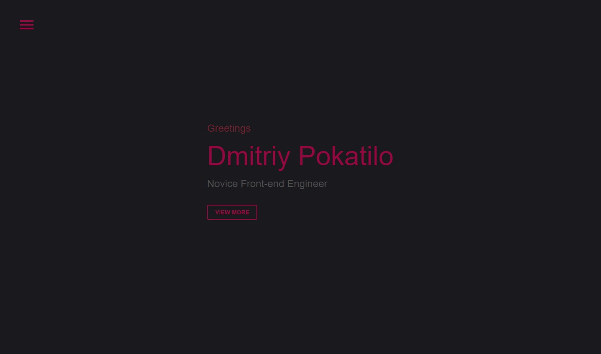

# AboutMe

:rose: Link: https://extashy.netlify.app/
## :blue_heart: What is it?
<strong>AboutMe</strong> is a portfolio site that contains some information about me, my current skills, links to my socials and works. The site also allows you to contact me through the feedback form (I will receive your message to my email).
## :purple_heart: What is used?
+ Vue 3 / Nuxt 3
+ SCSS
+ Eslint
+ Google Fonts
+ Formspree.io
+ Git / Netlify
## :yellow_heart: Structure and features
### :maple_leaf: Overall
This is a SPA consisting of three parts. And the project itself contains seven components.
### :maple_leaf: Responsiveness
The project has responsive design and can be interacted with mobile devices. 
For adaptive layout, media queries with different resolutions of mobile devices were used.
### :maple_leaf: Sections
The app consists of three section:
+ Title section
+ About section
+ Contact section

Each section contains a navigation menu and navigation buttons. 
The contact section contains a contact form, links and a footer with information about the author.
### :maple_leaf: Navigation
The site is navigated using the burger menu or a button on the page itself. 
The navigation between SPA parts is carried out using anchor-links.
### :maple_leaf: Form
The contact form has validation and uses the Formspree.io service. 
Subject to validation, the contents of the form are sent to my email via the "POST" method. 
The watch method is used to check data changes in the input.
The form validation checks the following conditions:
+ The name you enter in a name input must contain at least two letters.
+ The entered email address must be correct and contain the @ symbol.
+ Your message should contain at least three letters.
An error message appears under each input, if the condition of this input is violated. The message disappears as soon as the user satisfies the validation requirement.
### :maple_leaf: Links
My socials / CV section contains links with the relevant content.
### :maple_leaf: Return button
The button is located at the bottom of the site and also uses the anchor-link for navigation to the title section.